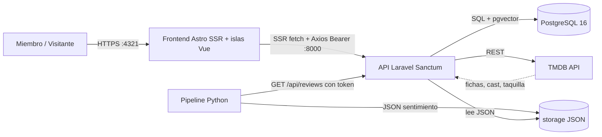
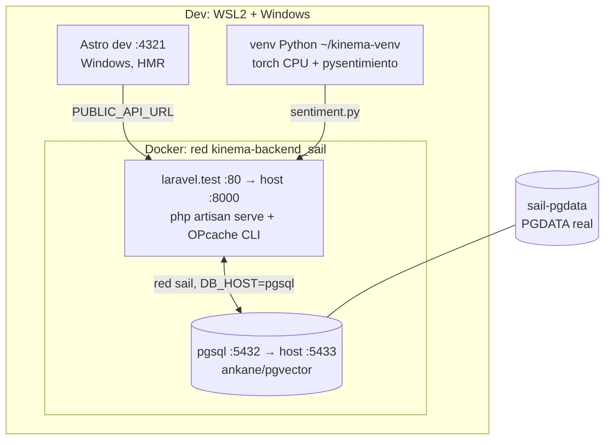
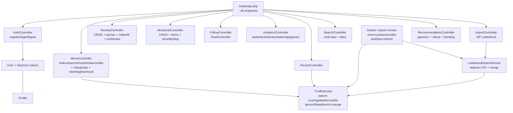
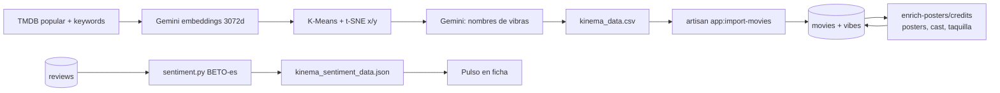

# Arquitectura — Kinema

## 1. Diagrama de contexto (C4 L1)

## 2. Contenedores (C4 L2, dev)

> Nota de ingeniería inversa: la imagen pgvector usa `PGDATA=/var/lib/postgresql/data`,
> distinto del volumen Sail por defecto. Sin el volumen nombrado `sail-pgdata`,
> cada recreate abandona los datos en un volumen anónimo (incidente real recuperado).

## 3. Componentes backend (C4 L3)

## 4. Frontend: páginas e islas

| Ruta | SSR | Islas (`client:load`) |
|---|---|---|
| `/`, `/search`, `/movie?id=` | fetch API en servidor | FeedActivity, Recommendations, LiveSearch(estático), MovieActions, MovieRating, ReviewForm, CommentsSection |
| `/login`, `/register` | estática | LoginForm, RegisterForm, UploadHistory |
| `/diary`, `/lists` | AuthGuard | MyDiary, MyLists |
| `/[u]/profile`, `/[u]/lists/[s]`, `/[u]/review`, `/artists/[id]/profile` | fetch API en servidor | FollowButton, ListDetail, CommentsSection, ActivityHeatmap, TasteRadar, GenreRadar, RatingsLine |

Patrón: SSR pinta primero (con token solo si hay sesión — sin token usa
públicos/fallbacks); las islas hidratan y personalizan con `kinema_token`.

## 5. Pipeline de datos

## 6. Decisiones de arquitectura (ADRs resumidos)

1. **Bearer tokens, no cookies**: se eliminó `EnsureFrontendRequestsAreStateful`
   (provocaba 419 CSRF en navegador). Sin estado servidor salvo token revocable.
2. **SSR con adapter Node**: el prerender estático devolvía 404 en rutas
   dinámicas; el layout es `.astro` (las directivas `client:*` no existen en SFC Vue).
3. **Merge por `tmdb_id`**: los stubs Letterboxd convergen al catálogo moviendo
   reseñas/items y borrando duplicados (transacción atómica).
4. **Scoring TMDB**: primer resultado crudo asignaba basura; se exige match fuerte.
5. **Analytics híbrida**: agregados SQL en vivo (rápidos) + NLP offline (pesado).
