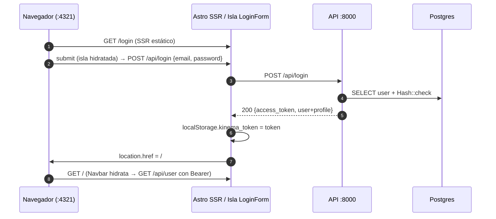
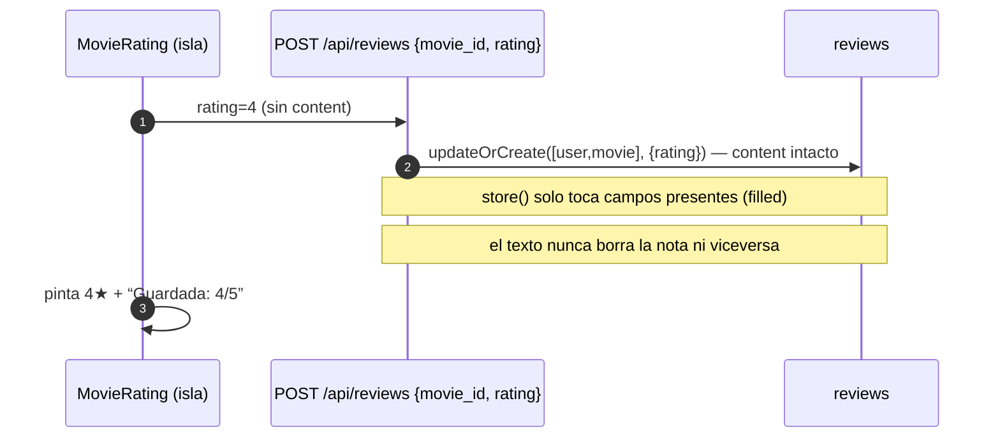
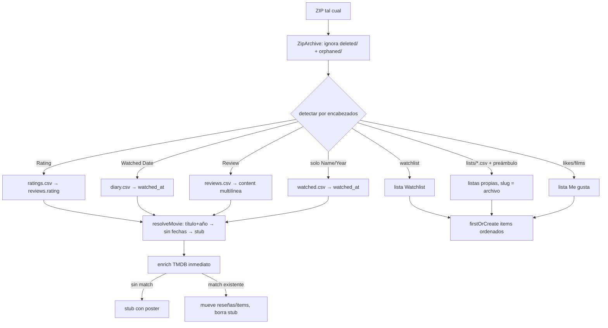
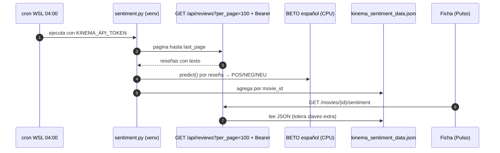
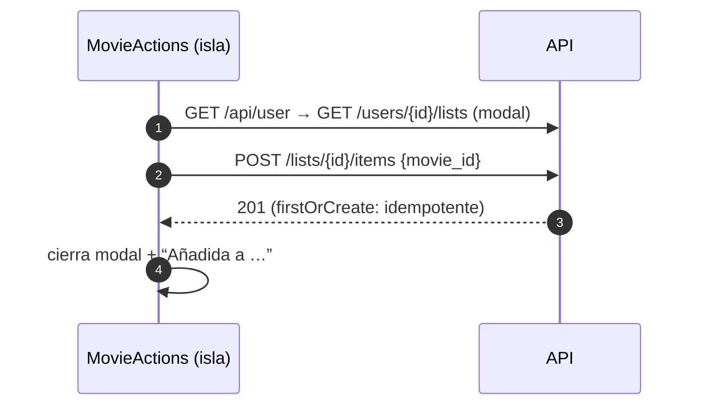

# Diagramas de flujo y secuencia — Kinema

## F1. Login con Bearer token



## F2. Calificar con estrellas sin reseña (merge por campo)



## F3. Importación Letterboxd (ZIP → convergencia)



## F4. Recomendaciones personalizadas

```mermaid
flowchart TB
    ME([GET /api/recommendations + Bearer]) --> HIS[reviews ≥4★ con vibe + embedding]
    HIS --> SIM[similar() pgvector × top-3 → “Porque te gustó X”]
    HIS --> VIB[top-2 vibras → no vistas con poster]
    SIM & VIB --> DEDUP[deduplica, máx 8]
    DEDUP --> FILL{< 6?}
    FILL -->|sí| TREND[relleno con trending]
    FILL -->|no| OUT([items + reasons])
    ANON([sin token]) --> TREND
```

## F5. Refresh de sentimiento (offline)



## F6. Añadir película a lista (modal)



## Matriz de permisos (resumen)

| Recurso | Anónimo | Dueño | Otro miembro |
|---|---|---|---|
| Ver películas, búsqueda, listas públicas, feed público | ✅ | ✅ | ✅ |
| Crear reseña/comentario/lista, follow, importar | ❌ 401 | ✅ | ✅ |
| Editar/borrar reseña, comentario, lista | — | ✅ | ❌ 404 |
| Ver lista privada | ❌ 403 | ✅ | ❌ 403 |
| `GET /api/reviews` (corpus NLP) | ❌ 401 | token servicio | token servicio |
